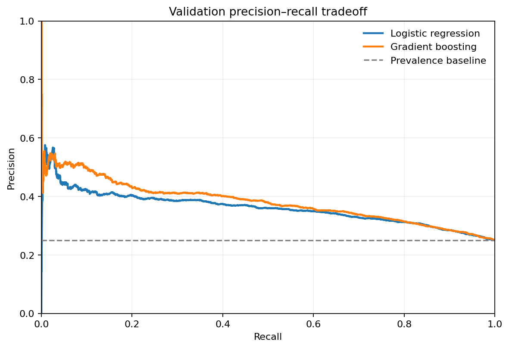
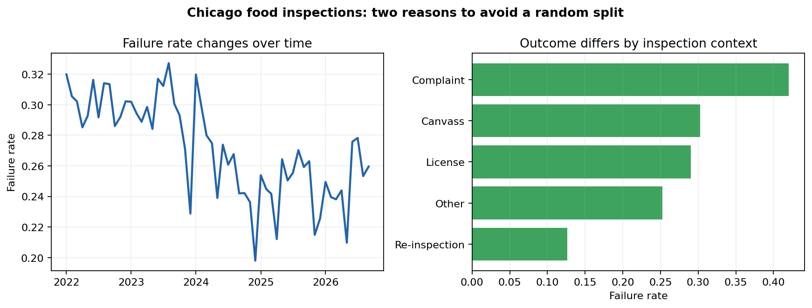
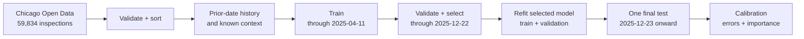
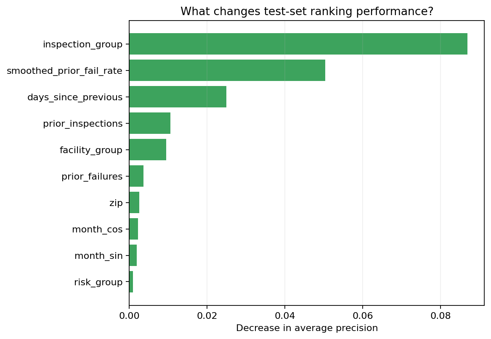
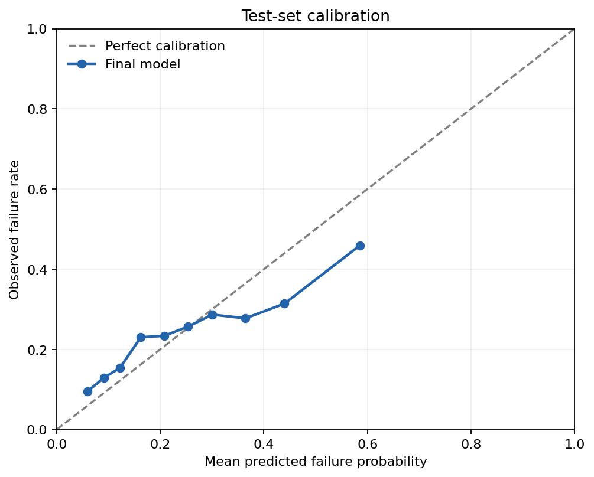

# Which food inspections are most likely to fail?

This project tests whether Chicago food-establishment inspections can be ranked by failure risk **using only information available before the inspector arrives**. It turns 59,834 public inspection records into leakage-safe history features, compares a prevalence baseline, logistic regression, and gradient boosting with chronological validation, and audits the selected model on an untouched 2026 test period.

## Key highlights

- Real longitudinal data covering 17,086 licensed establishments from January 2022 to September 2026.
- Prior-outcome features are shifted at the license-and-calendar-day level, preventing same-day result leakage.
- Whole-date chronological train/validation/test partitions mimic prediction on future inspections.
- Expanding-window cross-validation measures stability as policy and failure rates change.
- Evaluation includes average precision, ROC AUC, Brier score, top-decile usefulness, calibration, permutation importance, and segment-level errors.
- All reported figures are generated by one tested command; the narrow public extract and its SHA-256 provenance are committed.

## Result in one minute

Gradient boosting was selected on the validation period and then refit on train + validation data. On **7,995 untouched inspections from December 23, 2025 through September 4, 2026**, it achieved:

| Metric | Result | Interpretation |
|---|---:|---|
| Average precision | **0.370** | Prevalence-only reference is the 0.244 test failure rate |
| ROC AUC | **0.648** | Moderate ranking signal, not a deterministic forecast |
| Brier score | **0.179** | Lower is better; probability accuracy is useful but imperfect |
| Precision in top-risk 10% | **45.9%** | About 1.9× the overall test failure rate |
| Recall in top-risk 10% | **18.9%** | A narrow queue cannot capture most failures |

The model is useful for prioritization, not for replacing inspections or penalizing businesses. The highest predicted-risk bin is somewhat overconfident, and geographic/facility variables require governance review before any operational use.



## Question and hypotheses

The practical question is not “can I fit five classifiers?” It is: **could a planning team focus limited preparation or outreach capacity on a smaller set of upcoming inspections without using information discovered during those inspections?**

I expected prior failures, elapsed time since the last visit, inspection context, facility type, and risk classification to carry signal. I also expected outcome drift, making a random split optimistic.



EDA supports the second concern: monthly failure rates vary materially, and complaint inspections fail much more often than re-inspections in this extract. That is why every split moves forward in time.

## Methodology



### Leakage controls

The current result, violation text, business name, and anything observed by the inspector are excluded from predictors. History is calculated from previous calendar dates only. If a license has two records on the same day, neither outcome can enter the other's features. Preprocessors are fit inside scikit-learn pipelines, so imputation, scaling, and encoding learn only from the relevant training partition.

### Features

- Prior inspection count, prior failures, a weakly smoothed prior failure rate, and days since the prior inspection.
- Inspection group, facility group, risk classification, and ZIP code.
- Latitude/longitude and cyclic month features.

Rare facility categories are grouped to control cardinality. A fixed Beta-style smoothing rule prevents a single previous result from producing an extreme 0% or 100% historical rate.

### Model selection

Validation average precision was 0.250 for the prevalence baseline, 0.359 for logistic regression, and 0.381 for histogram gradient boosting. Three expanding-window folds also favored boosting (mean AP 0.414 vs 0.399). The final test score was lower than cross-validation, a sign of temporal drift rather than a result to hide.



Permutation importance indicates that inspection context, smoothed prior failure rate, and time since the previous inspection contribute most to test-set ranking. Importance is predictive, not causal: it does not mean changing an inspection type would change an establishment's outcome.



## Reproduce it

Requires Python 3.11+.

```bash
python -m venv .venv
# Windows: .venv\Scripts\activate
source .venv/bin/activate
pip install -e ".[dev]"

# Rebuild every checked-in metric, table, and plot from the committed extract
python -m inspection_risk train

ruff check src tests
pytest
```

To replace the sample with a fresh API extract, point the environment variable at a raw destination before downloading so the committed snapshot remains unchanged:

```bash
export INSPECTION_DATA_PATH=data/raw/chicago_food_inspections.csv
python -m inspection_risk download --since 2022-01-01T00:00:00.000 --max-rows 60000
python -m inspection_risk train
```

The final serialized model is intentionally ignored because it is reproducible from code and data. Metrics and audit tables are in `artifacts/reports/`.

## Repository map

```text
src/inspection_risk/data.py        public-data acquisition and schema checks
src/inspection_risk/features.py    cleaning, prior-date history, temporal split
src/inspection_risk/modeling.py    pipelines, comparison, CV, metrics
src/inspection_risk/evaluation.py  calibration, interpretation, error segments
src/inspection_risk/training.py    reproducible end-to-end experiment
data/sample/                       narrow real extract and provenance
artifacts/                          actual figures and reports
tests/                              leakage, split, and unknown-category tests
docs/                               code walkthrough and interview preparation
```

## Limitations and responsible use

Administrative data reflects inspection policy, scheduling, and recording practices—not only food-safety conditions. `Fail` is an imperfect outcome, records before 2022 are omitted, businesses can change while retaining identifiers, and unobserved factors limit performance. Location can proxy for socioeconomic conditions. Before operational use, I would involve inspectors, define the actual decision and cost of errors, audit subgroup behavior with appropriate protected/contextual data, recalibrate on a rolling window, and monitor drift. I would not use this score for automatic enforcement.

Full metrics are in [`artifacts/reports/metrics.json`](artifacts/reports/metrics.json); segmented false-negative/false-positive rates are in [`artifacts/reports/segment_error_analysis.csv`](artifacts/reports/segment_error_analysis.csv).

Data source: [City of Chicago Food Inspections](https://data.cityofchicago.org/Health-Human-Services/Food-Inspections/4ijn-s7e5). The source is updated over time, so a fresh download will not reproduce the committed snapshot byte-for-byte.
